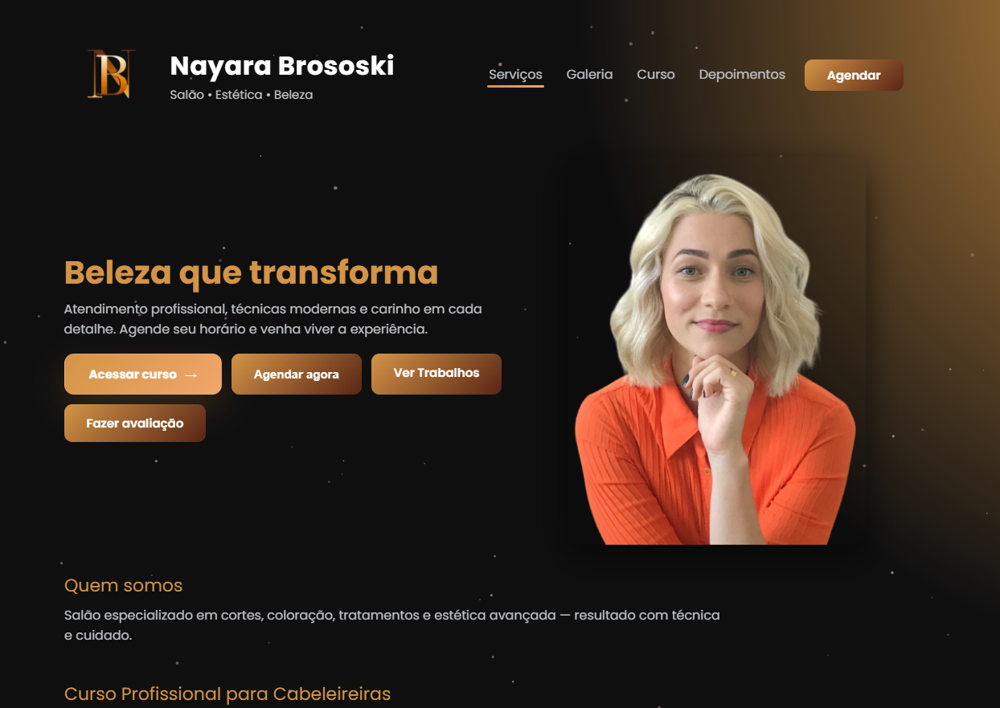

# Nayara Brososki

Site comercial para salão de beleza com foco em agendamento, apresentação de serviços e conversão por WhatsApp.

## Link ao vivo
https://www.nayarabrososki.shop/

## Sobre o projeto
Este projeto foi desenvolvido para apresentar os serviços do salão Nayara Brososki de forma profissional, responsiva e com foco em conversão.

A página reúne:
- apresentação da marca
- serviços oferecidos
- galeria
- depoimentos
- curso profissional
- chamada para agendamento

## Funcionalidades
- layout responsivo
- seção de serviços
- galeria visual
- depoimentos
- CTA para agendamento
- integração com WhatsApp
- links externos para checkout e redes sociais

## Tecnologias utilizadas
- HTML
- CSS
- JavaScript

## Meu papel no projeto
Desenvolvimento front-end, estrutura da página, responsividade, organização de conteúdo e publicação.

## Objetivo
Criar uma presença digital profissional para um negócio local e facilitar o contato com clientes.

## Melhorias futuras
- SEO
- otimização de performance
- analytics
- refatoração para React ou Next.js
