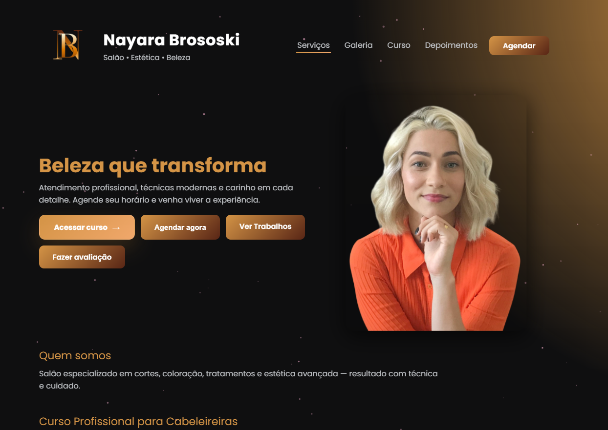

# Nayara Brososki — Site Comercial para Salão

Landing page/site comercial desenvolvido para um salão de beleza, com foco em **posicionamento de marca, apresentação de serviços e conversão por WhatsApp**.

## Site publicado

https://www.nayarabrososki.shop/

## Objetivo

Criar uma presença digital profissional para um negócio local e facilitar a transformação de visitantes em contatos e agendamentos.

A página foi estruturada para apresentar rapidamente:

- marca;
- serviços;
- resultados;
- prova social;
- curso profissional;
- chamada para agendamento.

## Principais recursos

- layout responsivo;
- hero comercial;
- apresentação de serviços;
- galeria visual;
- depoimentos;
- seção de curso;
- CTAs para WhatsApp;
- links para redes sociais;
- integração com checkout externo;
- domínio próprio.

## Foco de UX e conversão

O projeto prioriza:

- leitura rápida;
- hierarquia clara;
- chamadas de ação visíveis;
- experiência mobile;
- apresentação visual do trabalho;
- redução de atrito para entrar em contato.

## Tecnologias

- HTML
- CSS
- JavaScript
- GitHub Pages
- domínio personalizado

## Meu papel no projeto

- desenvolvimento front-end;
- estrutura da página;
- responsividade;
- organização de conteúdo;
- experiência do usuário;
- integração de CTAs;
- publicação e configuração do domínio.

## O que este projeto demonstra

- criação de landing page para negócio local;
- adaptação visual à identidade da marca;
- design responsivo;
- páginas voltadas à conversão;
- publicação em produção;
- integração com canais comerciais.

## Outros projetos do portfólio

- [Landing Page FR Distribuidora](https://github.com/gabrieelwilliam-source/landingpages)
- [Zion Automações](https://github.com/gabrieelwilliam-source/Site-automacao)
- [Horizonte Prime](https://github.com/gabrieelwilliam-source/HorizontePrime)
